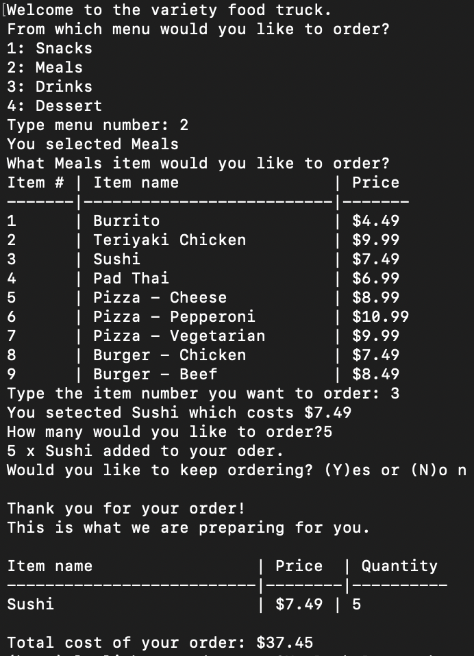

# Interactive Ordering System

## Overview

This project is an interactive ordering system for a food truck menu, designed as part of a Python assignment. The system allows users to select items from a menu, place an order, and receive a formatted receipt with the total price.

## Features

- Display a menu with various food categories and items.
- Allow users to select items from the menu.
- Validate user input to ensure correct item selection and quantities.
- Calculate and display the total price of the order.
- Print a formatted receipt for the user.

## Menu Structure

The menu is organized into categories with various items:

- *Snacks*
- *Meals*
- *Drinks*
- *Desserts*

## Usage

To use the interactive ordering system:

1. Open the terminal.
2. Navigate to the directory containing the Python script.
3. Run the script using Python:

   ```sh
   python your_script_name.py

4. Follow the prompts to select menu items and specify quantities.
5. Review the receipt and total price displayed on the screen.

## Requirements

- Python 3.x
- Terminal or command-line interface

## How It Works

**Initialization:** An empty order list is created.
**Menu Selection:** Users are prompted to select a menu item. Input is validated to ensure it's a number and exists in the menu.
**Quantity Input:** Users are prompted to enter a quantity. If input is invalid, the default value of 1 is used.
**Order Processing:** Selected items, prices, and quantities are added to the order list.
**Receipt Generation:** The order list is processed to generate and display a formatted receipt with total price.

## Example



## Acknowledgments

- Special thanks to ChatGPT for assisting with the code improvements, README formatting, and providing guidance throughout the development process.
- The code structure and example formats were influenced by various sources, including educational forums and resources.
- Developed as part of an assignment for AI Boot Camp.
- Special thanks to Firas Obeid for the guidance and support.

## Source Attribution

- **Code Sources:** All code was developed as part of the assignment unless otherwise specified. External code snippets or resources used are acknowledged in the Acknowledgments section.
- **Assistance:** Acknowledges the use of ChatGPT for general assistance without implying direct help from instructors.

## Contact

For questions or feedback, please contact lesliebarrera.d@gmail.com

